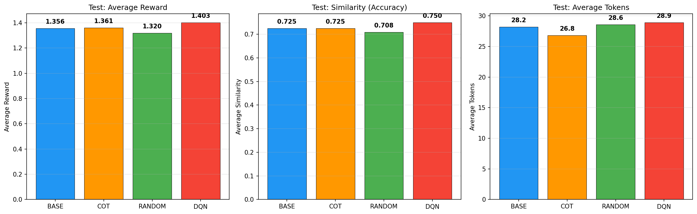
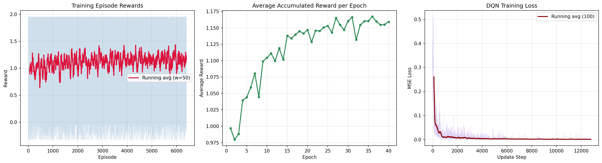

# Deep Q-Network (DQN) for Dynamic Prompt Modifier Selection


This repository implements a **Reinforcement Learning** approach to selecting discrete textual prompt modifiers. A Deep Q-Network (DQN) agent chooses instructions that are appended to a prompt for the frozen `TinyLlama-1.1B-Chat-v1.0` model. This is discrete prompt engineering; it does not optimize continuous soft-prompt embeddings.

The objective of the agent is to maximize the model's accuracy on the **BoolQ** (Yes/No Question Answering) dataset while heavily penalizing verbosity (producing unnecessarily long outputs).

---

## 📌 1. Project Architecture

This project formulates the prompt optimization problem as a **Markov Decision Process (MDP)** where the environment is the frozen LLM and the evaluation dataset.

### 1.1 The Environment (MDP)
- **Episodes**: Each episode consists of answering exactly one question from the BoolQ dataset. 
- **Time Steps**: $T = 2$ steps per episode. This allows the agent to make iterative, sequential modifications to the prompt before the final evaluation.

### 1.2 State Space (389 Dimensions)
To make intelligent decisions, the DQN agent requires an understanding of the current context. The state representation is a continuous vector of 389 dimensions:
1. **Question Embedding (384d)**: The input question is encoded using `sentence-transformers/all-MiniLM-L6-v2` to capture semantic meaning.
2. **Active Modifiers (3d)**: A one-hot encoded vector representing which specific prompt modifiers are currently active.
3. **Last Similarity (1d)**: The performance (similarity to ground truth) of the LLM's response in the previous step.
4. **Last Token Count (1d)**: The number of tokens the LLM generated in the previous step, scaled for the neural network.

### 1.3 Action Space (6 Discrete Actions)
At each step, the agent can choose one of 6 discrete actions to manipulate the prompt:
- `0 - KEEP`: Make no changes.
- `1 - ADD_COT`: Append *"Think step by step."* (Chain of Thought).
- `2 - ADD_CONCISE`: Append *"Be concise, max 2 sentences."*
- `3 - ADD_CHECK`: Append *"Double-check before final."*
- `4 - REMOVE_LAST`: Remove the most recently added modifier.
- `5 - RESET_ALL`: Clear all active modifiers.

### 1.4 Reward Function
The reward signal directly reflects our dual objective: **Accuracy** and **Conciseness**.

$$ R = 	ext{Similarity}(Answer, GroundTruth) - 0.2 \times \min\left(1, \frac{Tokens}{120}\right) $$

- **Similarity**: 1.0 if the LLM correctly outputs Yes/No, otherwise 0.0.
- **Penalty**: A linear penalty scaled up to a maximum of 120 tokens, discouraging the model from generating long, rambling answers.

---

## 🧠 2. Deep Q-Network (DQN) Agent

The reinforcement learning agent is built using **PyTorch** and implements standard DQN stabilization techniques:
- **Experience Replay Buffer**: Stores transitions $(S, A, R, S')$ and samples mini-batches during training to break temporal correlations.
- **Target Network**: A separate Q-network used to compute stable TD-targets, updated softly every $C$ steps.
- **Epsilon-Greedy Exploration**: Balances exploration and exploitation, decaying $\epsilon$ from $1.0 \rightarrow 0.05$ over the course of training.
- **Neural Network Architecture**: A Multi-Layer Perceptron (MLP) with 3 hidden layers, taking the 389d state and outputting 6 Q-values.

---

## 📊 3. Experimental Results

The agent was trained for **40 epochs** (160 train samples per epoch) and evaluated on a seeded holdout test set of **40 samples**. These results are a small-scale experiment and should not be interpreted as a full BoolQ benchmark.
We compare the trained DQN agent against three baselines:
1. **BASE**: Zero-shot prompting (No modifiers).
2. **COT**: Standard Chain-of-Thought (Always applies Action 1).
3. **RANDOM**: Uniform random action selection over $T=2$ steps.

### Quantitative Comparison (Test Set)

| Method | Avg Similarity | Avg Tokens | Avg Reward |
|--------|---------------|------------|------------|
| BASE   | 0.6750        | 12.8       | 1.3560     |
| COT    | 0.6750        | 10.7       | 1.3607     |
| RANDOM | 0.6500        | 11.4       | 1.3200     |
| **DQN**| **0.7000**    | **9.5**    | **1.4031** |

`Avg Reward` is the mean undiscounted return across the two environment steps in each episode. `Avg Similarity` and `Avg Tokens` report the final step only, so the reward column is not computed directly from those two displayed averages.

### 3.1 Test Set Performance Bar Chart
<p align="center">
  
</p>

### 3.2 Training Dynamics (Loss and Reward)
The learning curves demonstrate stable convergence, with the DQN loss minimizing over time and the moving average of the reward consistently increasing as the agent learns the optimal policy.
<p align="center">
  
</p>

---

## 💻 4. Codebase Structure

Since this repository contains pure Python scripts instead of Jupyter Notebooks, the architecture is modularized for scalable training:

- `setup.py`: Environment configuration. Automates the downloading and preprocessing of the `google/boolq` dataset.
- `env.py`: Implements the Custom OpenAI Gym/Gymnasium environment wrapping the LLM generation and embedding extraction.
- `dqn.py`: Contains the PyTorch implementation of the `DQNAgent`, Replay Buffer, and Q-Networks.
- `train.py`: The main training loop execution script.
- `eval.py`: Loads the trained model (`saved_models/dqn_agent.pth`), runs evaluation against baselines, and generates the plots in `results/`.

---

## 🚀 5. Quickstart Guide (Kaggle)

This project is compute-intensive due to iterative LLM generation. It is designed to run seamlessly on a Kaggle **T4 x2 GPU** environment.

```bash
# 1. Setup Environment (Installs dependencies & prepares data/models)
python setup.py

# 2. Train DQN Agent (~2-3 hours on T4 GPU)
python train.py --epochs 40 --seed 42

# 3. Evaluate Agent and Generate Plots
python eval.py
```

---

## 🏆 6. Conclusion

The results clearly demonstrate that Reinforcement Learning can be effectively used for **Prompt Engineering**. Instead of relying on static, human-crafted prompts, the DQN agent learned to dynamically analyze the current state (the question embedding and previously applied modifiers) and select the optimal sequence of prompt instructions.

Specifically, the trained DQN agent:
1. **Outperformed Baseline Methods**: It achieved a higher average accuracy (0.700) compared to Zero-Shot (0.675) and standard Chain-of-Thought (0.675).
2. **Reduced Verbosity**: It generated the most concise answers (9.5 tokens on average), significantly reducing the fluff generated by the LLM compared to Zero-Shot (12.8 tokens).
3. **Learned Dynamic Policies**: By outperforming the RANDOM baseline, it proved that the agent didn't just stumble upon good prompts, but actively learned a context-aware policy that balances accuracy and brevity.

---

## License

Released under the [MIT License](LICENSE).
